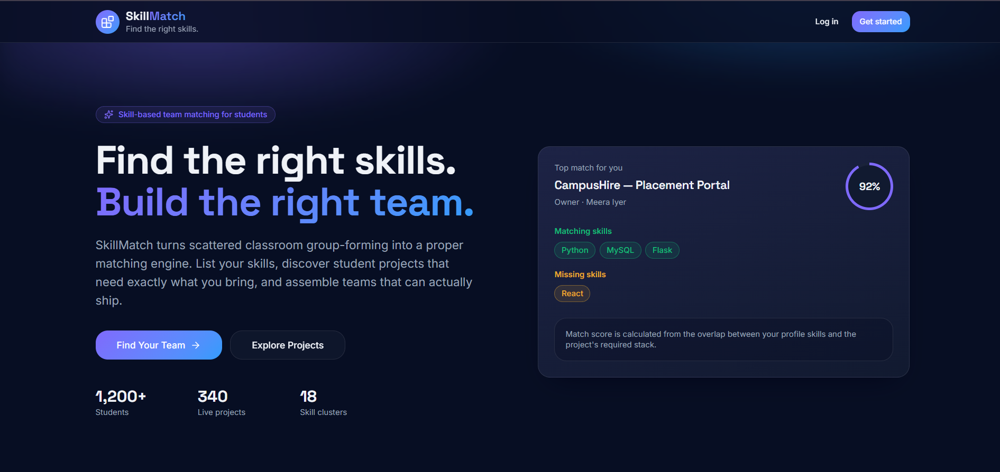
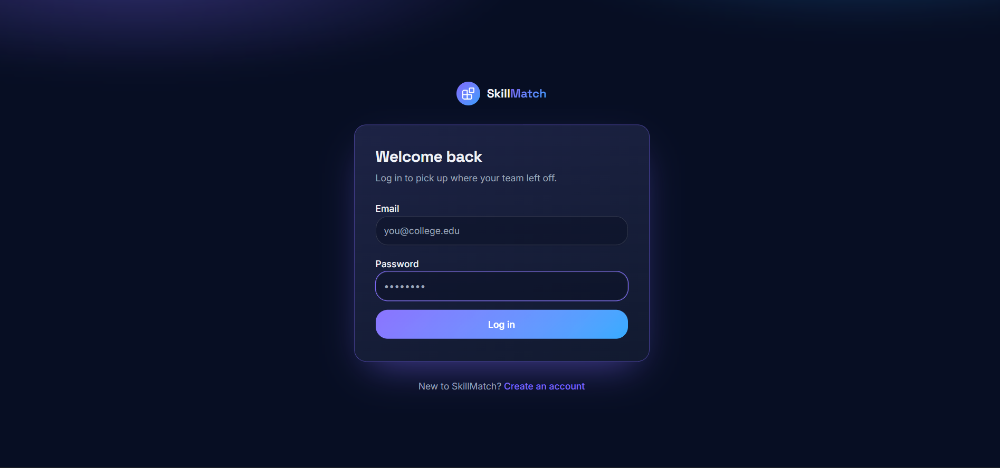
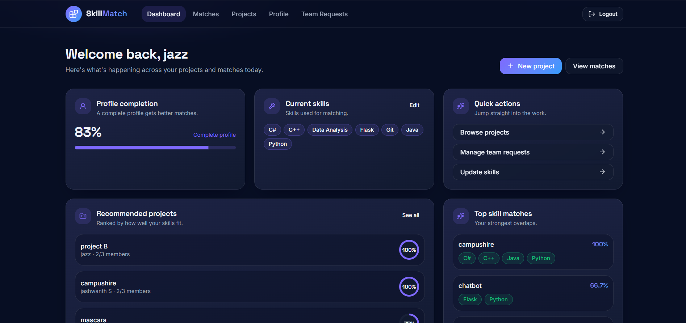
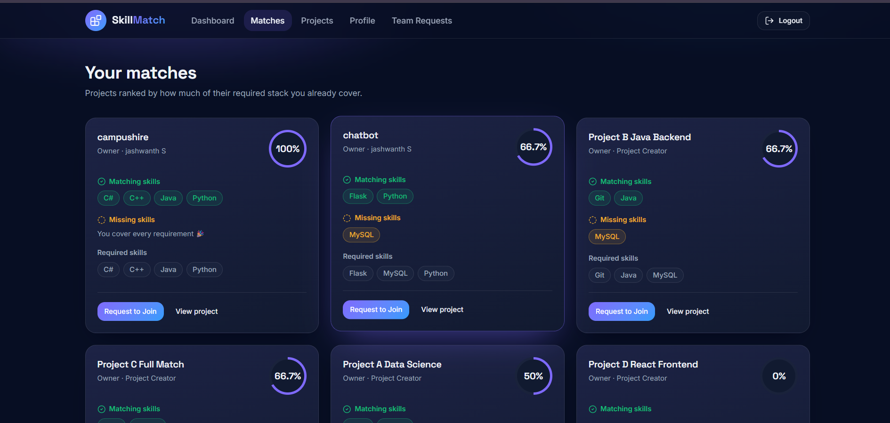
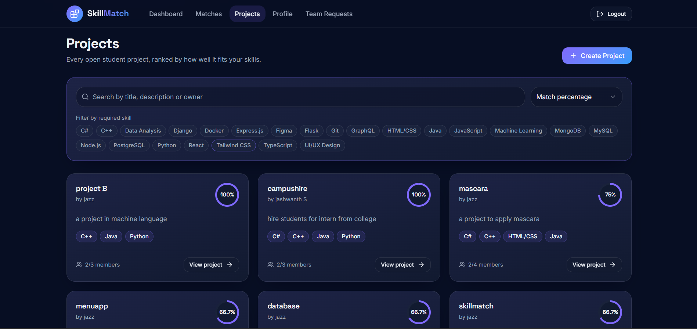
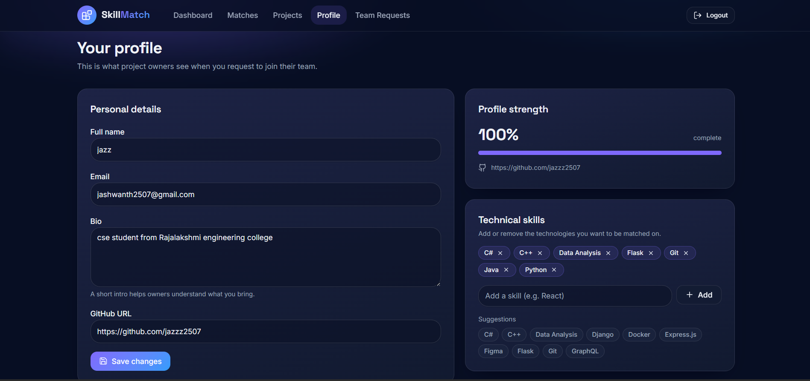
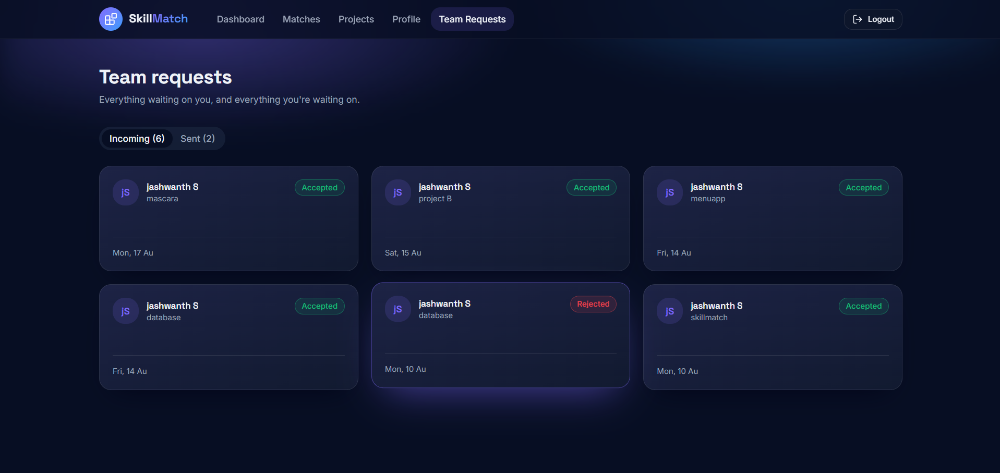

# 🚀 SkillMatch

SkillMatch is a full-stack student collaboration platform designed to help students discover projects, connect with like-minded teammates, and build stronger project teams through skill-based matching.

The platform allows students to create profiles, showcase their technical skills, browse projects, receive personalized project recommendations, send team requests, and collaborate effectively.

---

## ✨ Features

### 👤 User Authentication

* User Registration
* User Login
* Secure Session Management
* Logout Functionality

### 📝 Profile Management

* Edit Personal Information
* Add GitHub Profile Link
* Add and Manage Technical Skills
* View Profile Completion

### 🚀 Project Management

* Create New Projects
* Edit Existing Projects
* Browse All Projects
* Search Projects
* Filter Projects by Skills

### 🎯 Skill-Based Matching

* Intelligent Skill Matching Algorithm
* Match Percentage Calculation
* Personalized Project Recommendations
* Matching Skills Analysis
* Missing Skills Identification

### 🤝 Team Request System

* Send Join Requests
* View Incoming Requests
* View Sent Requests
* Accept Requests
* Reject Requests

### 📊 Dashboard

* Personalized Overview
* Project Statistics
* Match Insights
* Quick Navigation

---

## 🛠️ Tech Stack

### Frontend

* React
* TypeScript
* Vite
* TanStack Router
* TanStack Query
* Tailwind CSS
* ShadCN UI

### Backend

* Python
* Flask
* REST APIs

### Database

* MySQL

### Version Control

* Git
* GitHub

---

## 📂 Project Structure

```text
project-SkillMatch/
│
├── screenshots/
│   ├── landing-page.png
│   ├── login-page.png
│   ├── dashboard.png
│   ├── matches.png
│   ├── projects.png
│   ├── profile.png
│   └── team-requests.png
│
├── skillmatch-collab-ui/
│   ├── src/
│   ├── public/
│   ├── package.json
│   └── vite.config.ts
│
├── static/
├── templates/
│
├── api.py
├── app.py
├── db.py
├── requirements.txt
├── README.md
└── .gitignore
```

---

## 📸 Application Screenshots

### 🏠 Landing Page



### 🔐 Login Page



### 📊 Dashboard



### 🎯 Matches Page



### 🚀 Projects Page



### 👤 Profile Page



### 🤝 Team Requests Page



---

## ⚙️ Installation Guide

### 1️⃣ Clone the Repository

```bash
git clone https://github.com/jazzz2507/Skillmatch.git
cd Skillmatch
```

### 2️⃣ Create Virtual Environment

```bash
python -m venv venv
```

### 3️⃣ Activate Virtual Environment

#### Windows

```bash
venv\Scripts\activate
```

#### Linux / macOS

```bash
source venv/bin/activate
```

### 4️⃣ Install Backend Dependencies

```bash
pip install -r requirements.txt
```

### 5️⃣ Configure Database

Create a MySQL database and update the database credentials according to your local setup.

Example:

```python
host="localhost"
user="root"
password="your_password"
database="skillmatch_db"
```

### 6️⃣ Run Flask Backend

```bash
python app.py
```

Backend will run at:

```text
http://localhost:5000
```

### 7️⃣ Install Frontend Dependencies

```bash
cd skillmatch-collab-ui
npm install
```

### 8️⃣ Run Frontend

```bash
npm run dev
```

Frontend will run at:

```text
http://localhost:8080
```

---

## 🎯 How SkillMatch Works

1. Students create an account.
2. Students add their technical skills.
3. Project owners create projects and specify required skills.
4. SkillMatch compares user skills with project requirements.
5. Match percentages are calculated automatically.
6. Students discover suitable projects.
7. Team requests are sent and managed within the platform.
8. Teams collaborate and build projects together.

---

## 💡 Key Learning Outcomes

This project helped in learning:

* Full Stack Development
* REST API Development
* React & TypeScript
* Flask Backend Development
* MySQL Database Design
* Authentication & Authorization
* State Management
* Frontend–Backend Integration
* Git & GitHub Workflow
* Debugging and Problem Solving

---

## 🚀 Future Enhancements

* Real-Time Notifications
* In-App Chat System
* AI-Powered Project Recommendations
* Resume Integration
* Email Notifications
* Project Progress Tracking
* Team Analytics Dashboard
* Mobile Application Version

---

## 👨‍💻 Author

### Jashwanth S

Second-Year Computer Science Engineering Student

* GitHub: https://github.com/jazzz2507
* LinkedIn: www.linkedin.com/in/jashwanth-s-91476b380


---

## ⭐ Support

If you found this project useful, consider giving it a ⭐ on GitHub.

Feedback and contributions are always welcome!

